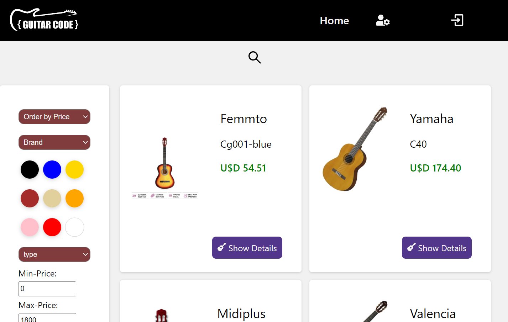
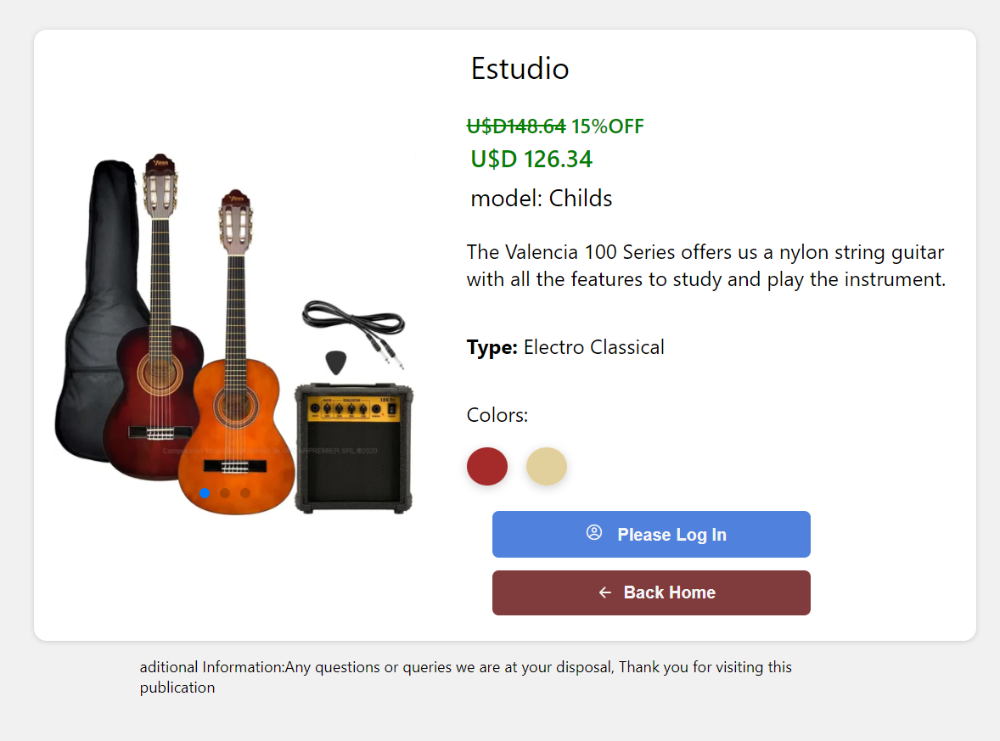
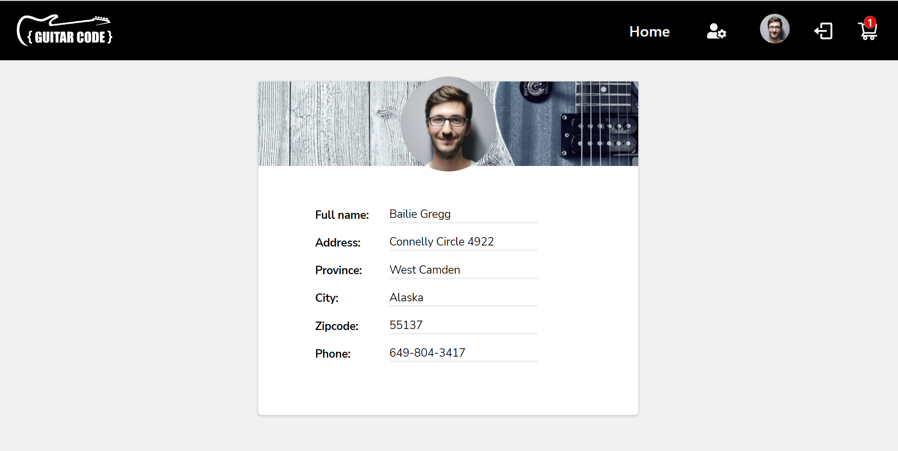
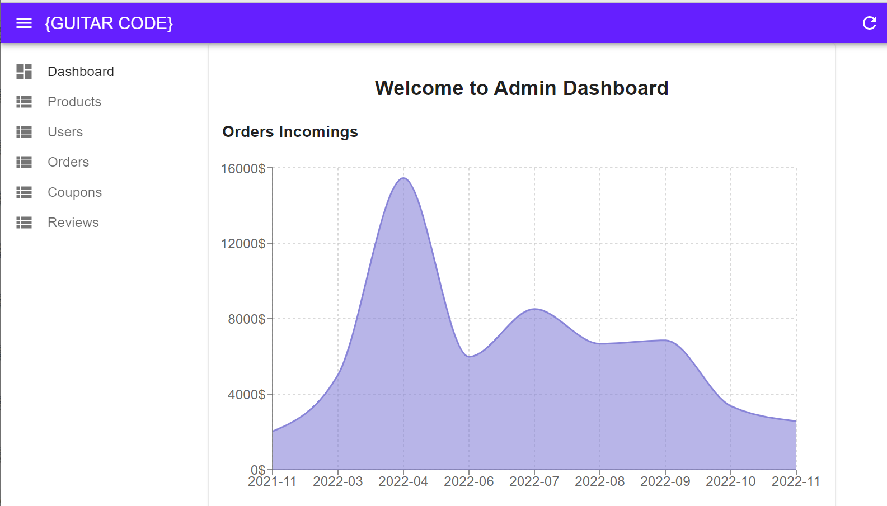
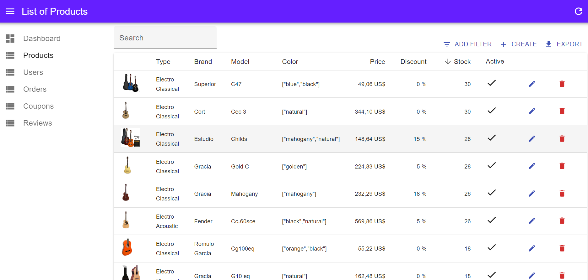
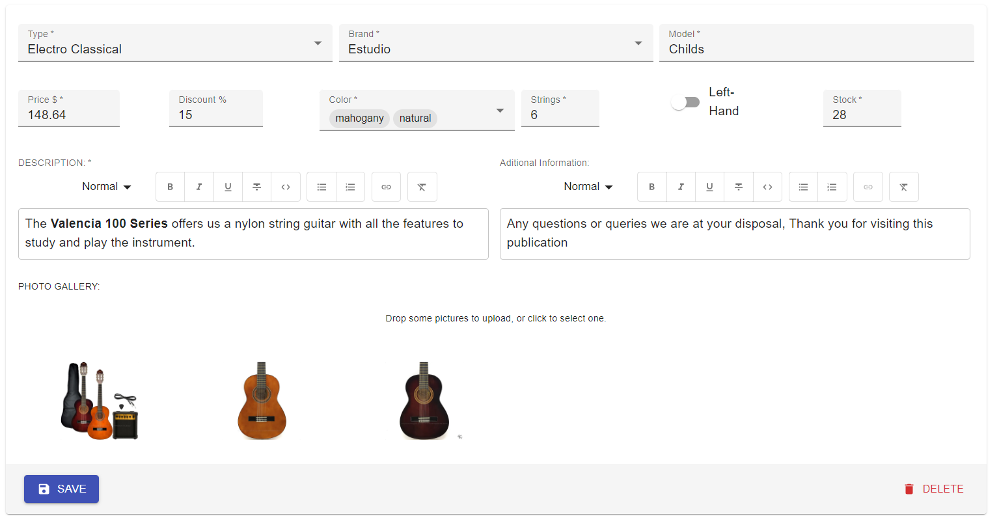
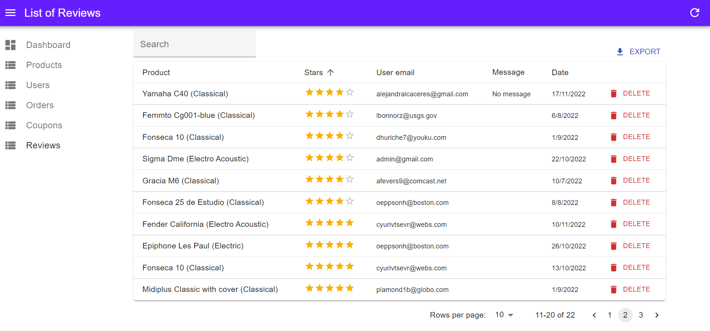

# { Guitar Code } 
#### _Team Project for Henry Bootcamp_ 🚀

## Functionalities

### Shop Page
- Landing page with an intro and relevant information like offers
- List of products by visualizing them by paging.
- View the details of each guitar.
- Search products by brand and type. Sort by price.
- Filter by diferent features like color, price, etc.
### Dashboard
- Estadistic chart of orders incomings by month.
- List, create, edit and delete products.
- List of registered users in shop
- List of orders with status detail
- Creation and management of discount coupons.
- List of reviews submitted by purchasers

#### Aditional Info

- The project was developed under the SCRUM framework.
- The execution of the entire project lasted 3 weeks.
- The frontend and backend were developed as separate projects.

## ⚡ Main Technologies

- Frontend: **_React, Redux Toolkit, React Router v6, Styled Components, React Google Login, MaterialUI, React-Admin, Recharts_**
- Backend: **_nodeJS, ExpressJS, Sequelize, PostgreSQL, NodeMailer_**

## 🔗 Demo

 https://e-guitar-react.vercel.app

| Landing      | Homepage |
| ----------- | ----------- |
|  |  |

| Detail page      | Profile page |
| ----------- | ----------- |
|  |  |

| Dashboard      | Product List |
| ----------- | ----------- |
|  |  |

| Create product      | Reviews |
| ----------- | ----------- |
|  |  |

## Authors

|  |  |  |  |  |  |
| ----------- | ----------- | ----------- | ----------- | ----------- | ----------- |
| @mateorogatky | @aicaceres | @TorianNomas | @a1l1n | @djaroldito | @miguel-mm89 |

